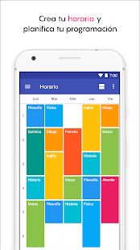
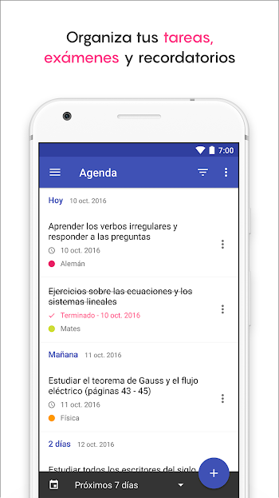
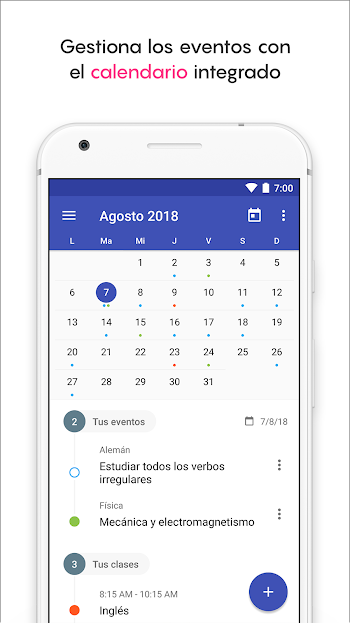

# Prebe agenda (escolar)

Desarrollar una aplicación que sirva para que la comunidad universitaria pueda organizar sus pendientes y tareas del día a día.

## Requerimentos funcionales

La aplicación deberá tener las siguientes funcionalidades

* Debe ofrece una vista principal en donde se muestre un menú de las funcionalidades de la agenda. 

* Posibilidad de diseñar el horario escolar del usuario.

  En dicho horario se deben incluir los datos de los profesores y asignaturas que el usuario esta cursando.

  

  Los profesores y las asignaturas pueden ser agregados de manera individual.

* Posibilidad de tener una seccón para agregar las tareas pendientes. Se debe tener una relación de la siguiente manera.

  Se debe poder indicar un nombre para la tarea, una fecha de entrega y la materia de la que es de tarea.

  

  Por último, debe ser posible indicar el estado de la tarea (si aún es vigente o si ya ha sido terminada). Como se muestra en la imagen, la vista "agenda" debe de dividir las tareas conforme a la fecha de entrega.

  La vista agenda debe de incluir una segunda vista en donde se desplegue un calendario con los deberes del alumno.

  

* En la vista principal deberá mostrar un esquema de los días en el usuario tiene la mayor cantidad de pendientes, para esto deberá basarse en la cantidad de pendientes que el usuario ha ingresado en la sección de "agenda".

* Para poder utilizar la aplicación primero se debe de iniciar sesión, la sesión puede iniciar a través de la aplicación o a través de facebook.

* La aplicación deberá desplegar una notificación de las tareas pendientes a la hora que el usuario lo indique.

## Requerimentos técnicos

Los siguientes elementos deben de estar presentes en el desarrollo de la aplicación.

* Es de vital importancia que su proyecto sea responsivo. TIP. utilicen fragmentos para lograrlo.
* Uso de `fragments` a lo largo de la vista de las aplicaciones.
* Uso de los `intent implicitos` utilizando `NATIVE_ACTIONS`.
* Uso de `menús contextuales` o cuadros de dialogo.
* Integración con  `material design` o en su defecto presentar una vista que bien diseñada, es decir, que sea agradable al usuario.

## Especificaciones de la entrega

* El proyecto deberá ser subido en el repositorio de alguno de los integrantes del equipo.
* El proyecto deberá contar con un README.md en donde se especifique lo siguiente.
  * El nombre de la aplicación así como una breve descripción de lo que hace y como funciona.
  * Las tecnologías y sus versiones que se utilizaron para crear la aplicación. Asi como la última fecha en la que fue compilado el proyecto.
  * Sus correo para aclaraciones sobre el proyecto
  * Lo que ustedes creen que costaría su aplicación y el tiempo que se tardaron en desarrollarlo.
* **Deben incluir capturas  de pantalla por cada funcionalidad de la aplicación.** 

### IMPORTANTE

* No se permite el plagio.
* Se permite el uso de código libre, siempre en cuando hagan lo necesario para darle los créditos a quien le correspondan.
* Deben de tener un avance constante el la realización de su proyecto, es decir, deben tener commits por día de su proyecto.