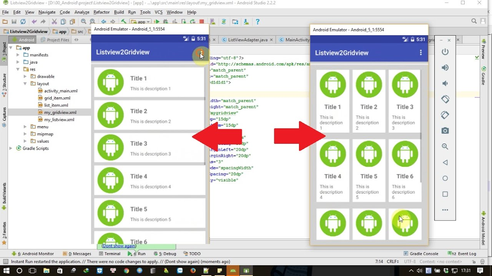
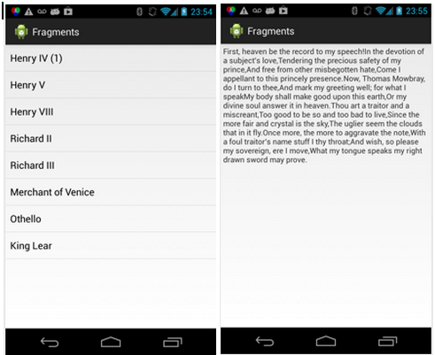
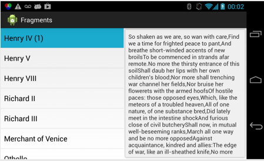

# Prebe Ebook

Desarrollar una aplicación que permita a un usuario tener organizar, comprar y leer libros digitales.

## Requerimentos funcionales

La aplicación deberá tener las siguientes funcionalidades

- Debe ser capaz de mostrar sección en donde se muestren todos los libros. Dichos libros se deben mostrar en un gridview que se podrá cambiar a un listview por medio de un botón o de una acción en que ustedes definan. 

  Debe quedar similar a la siguiente imagen, pero con libros.

  

* Su aplicación debe de mostrar una vista que simule una tienda en donde el usuario pueda comprar nuevos e-books. Si el usuario decide comprarlos deberá comenzarse a descargar el libro y agregarse a su lista de libros.

* Por último deberá incluir un visor para los libros que el usuario posea. Debe debe verse como lo indica la siguiente imagen.

  

  

## Requerimentos técnicos

Los siguientes elementos deben de estar presentes en el desarrollo de la aplicación.

* Cada e-book debe ser tratado como un archivo de texto plano y este debe estar conformados por
  * Un capitulo y su contenido.

- Uso de `fragments` a lo largo de la vista de las aplicaciones. ES ALTAMENTE RECOMENDABLE que los utilicen para poder hacer su aplicación responsiva.
- Uso de layouts 'dinámicos', esto es, `Cardviews`, `Listview`, etc.
- Uso de los `intent implicitos` utilizando `NATIVE_ACTIONS`.
- Integración con  `material design` o en su defecto presentar una vista que bien diseñada, es decir, que sea agradable al usuario.
- Uso y creación de un `webservice` para consumo de la aplicación.
- Uso y manejo de `archivos JSON`

### Recomendaciones

* Utlizar programación en paralelo para resolver el problema de las descargar.
* Para el visor de  e-books mi recomendación es utilizar fragments. Tendrán que utilizar los fragments de manera dinámica. Hay muchos tutoriales de como se hace eso. la mayoria convergen utilizar una clase llamada `FragmentManager`, utilizarán métodos como `beginTransaction()`, `commit()` y `replace()`. Los vieron con Nestor.

## Especificaciones de la entrega

- El proyecto deberá ser subido en el repositorio de alguno de los integrantes del equipo.
- El proyecto deberá contar con un README.md en donde se especifique lo siguiente.
  - El nombre de la aplicación así como una breve descripción de lo que hace y como funciona.
  - Las tecnologías y sus versiones que se utilizaron para crear la aplicación. Asi como la última fecha en la que fue compilado el proyecto.
  - Sus correo para aclaraciones sobre el proyecto
  - Lo que ustedes creen que costaría su aplicación y el tiempo que se tardaron en desarrollarlo.
- **Deben incluir capturas  de pantalla por cada funcionalidad de la aplicación.** 

### IMPORTANTE

- No se permite el plagio.
- Se permite el uso de código libre, siempre en cuando hagan lo necesario para darle los créditos a quien le correspondan.
- Deben de tener un avance constante el la realización de su proyecto, es decir, deben tener commits por día de su proyecto.